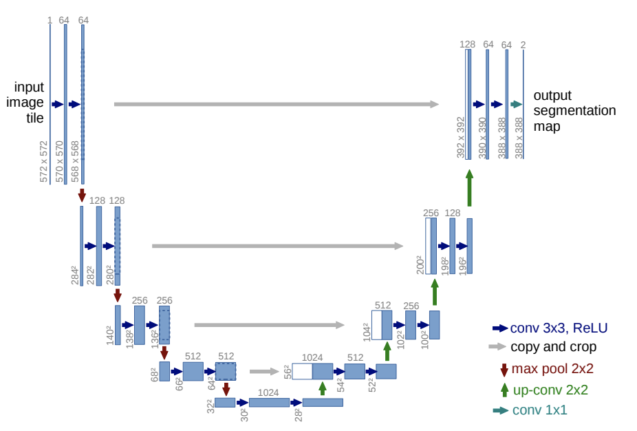
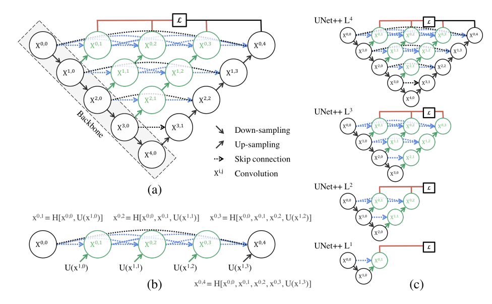
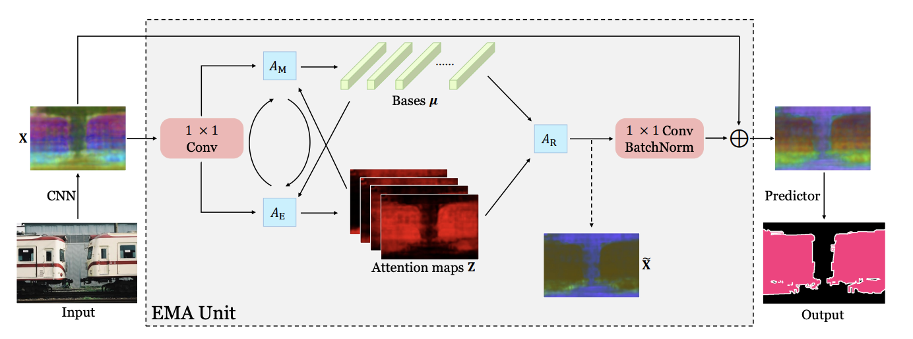

# Semantic Segmentaion for Weizmann Horse Database

[Homework] Fanpeng Meng's Final work for Visual Cognition Engineering 2022-Spring, School of AIA, HUST.

## Summary

In this work, I implied semantic segmentation model `UNet`, `Unet++` and `EMANet` on Weizmann Horse Dataset, acheiving the target `MIOU` and `BIOU` in part of the experiments. 

**UNet** [[paper]](https://arxiv.org/abs/1505.04597) &nbsp;
**UNet++** [[paper]](https://arxiv.org/abs/1807.10165) [[code]](https://github.com/MrGiovanni/UNetPlusPlus)  &nbsp;
**EMANet** [[paper]](https://ieeexplore.ieee.org/document/9009057) [[code]](https://github.com/XiaLiPKU/EMANet)

**[DATASET]** **Weizmann Horse** [[Kaggle]](https://www.kaggle.com/datasets/ztaihong/weizmann-horse-database) 

**[EVALUATION]** **BIOU** [[paper]](https://arxiv.org/abs/2103.16562)

<div align=center>
    
    
    <br>Unet & Unet++
</div>

<div align=center>
    
    <br>EMANet
</div>


## Installation

Using commands to install the environment:

```bash
pip -r requirements.txt
```
    
## Data Preparation

Prepare your dataset as below: 

````
dataset 
  └──── weizmann_horse_db
    ├──── horse 
    │ ├──── horse001.png 
    │ ├──── horse002.png 
    │ ├──── horse003.png
    │ ├──── ... 
    │ └──── horse327.png 
    └──── mask 
      ├──── horse001.png 
      ├──── horse002.png 
      ├──── horse003.png
      ├──── ... 
      └──── horse327.png
````

## Training and Testing

Training and testing on UNet, configuring the training in `config/unet_config.py`:

```python
python main_unet.py
```

Training and testing on UNet++, configuring the training in `config/unet_config.py`:

```python
python main_unetpp.py
```

Training and testing on EMANet, configuring the training in `config/emanet_config.py`:

```python
python main_emanet.py
```

* I trained the model on a single **NVIDIA A30 (24 GB)**. 250 epochs training takes about 10 minutes for **UNet**, 20 minutes **UNet++** and **EMANet**. The current bottleneck is the parallel computing, I didn't apply parallel training for the reason that the training scale is quite elite, it's not worthy to do that.

## Result and Explaination

The result is shown below: 

MIOU: 

| Model   | 1 Epoch   | 20 Epoch  | Best      |
| ------- | --------- | --------- | --------- | 
| UNet    | 0.576     | **0.904** | **0.914** |
| UNet++  | 0.588     | 0.817     | 0.889     |
| EMANet  | **0.617** | 0.791     | 0.806     |

BIOU: 

| Model   | 1 Epoch   | 20 Epoch  | Best      |
| ------- | --------- | --------- | --------- |
| UNet    | **0.310** | **0.717** | **0.745** |
| UNet++  | 0.164     | 0.536     | 0.701     |
| EMANet  | 0.198     | 0.459     | 0.493     |

* `Best` means the best performance in 250 epochs

* The results are shown in detail in my [report (CN)](./assets/report.pdf). I didn't achieve perfect performance on EMANet, and the analyze was also mentioned in the report. 

* My weight of models was saved in my [Google Drive](https://drive.google.com/drive/folders/107VEvDVexsOBripzJuUHNwN8GmgVY5nS?usp=sharing). I saved the weight every 50 epochs, as well as the weight of best model. 

* My tensorboard events of the training was also provided in my [Google Drive](https://drive.google.com/drive/folders/107VEvDVexsOBripzJuUHNwN8GmgVY5nS?usp=sharing). You can review my training.

* Support Material: [Google Drive](https://drive.google.com/drive/folders/107VEvDVexsOBripzJuUHNwN8GmgVY5nS?usp=sharing)


## Contract

Mail me at [HUST-Mail](fanpengmeng@hust.edu.cn) or [Gmail](fpmeng0610@gmail.com)

## Reference

The following works are appreciated for great credit to my work:

```
@inproceedings{ronneberger2015u,
  title={U-net: Convolutional networks for biomedical image segmentation},
  author={Ronneberger, Olaf and Fischer, Philipp and Brox, Thomas},
  booktitle={International Conference on Medical image computing and computer-assisted intervention},
  pages={234--241},
  year={2015},
  organization={Springer}
}

@incollection{zhou2018unet++,
  title={Unet++: A nested u-net architecture for medical image segmentation},
  author={Zhou, Zongwei and Rahman Siddiquee, Md Mahfuzur and Tajbakhsh, Nima and Liang, Jianming},
  booktitle={Deep learning in medical image analysis and multimodal learning for clinical decision support},
  pages={3--11},
  year={2018},
  publisher={Springer}
}

@inproceedings{li2019expectation,
  title={Expectation-maximization attention networks for semantic segmentation},
  author={Li, Xia and Zhong, Zhisheng and Wu, Jianlong and Yang, Yibo and Lin, Zhouchen and Liu, Hong},
  booktitle={Proceedings of the IEEE/CVF International Conference on Computer Vision},
  pages={9167--9176},
  year={2019}
}
```